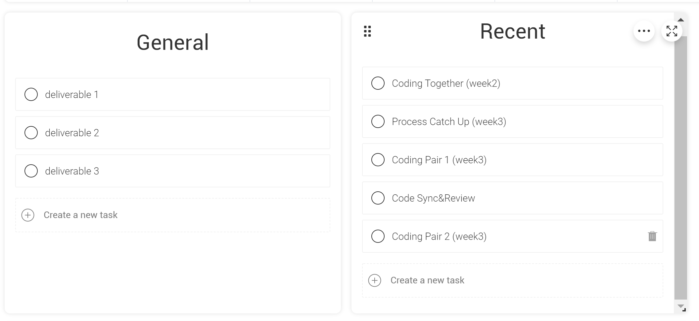

# Ontario Lease Wizard
> _Note:_ This document is meant to evolve throughout the planning phase of your project.    
 > That is, it makes sense for you commit regularly to this file while working on the project (especially edits/additions/deletions to the _Highlights_ section).
 > Most importantly, it is a reflection of all the planning you work you've done in the first iteration. 
 > **This document will serve as an agreement between your team and your partner.**

## Product Details
 
#### Q1: What are you planning to build?
       
We are building a web application to simplify all the procedures of signing the Ontario Lease Agreement between landlords and tenants in a standardized and scientific way.   

More specifically, the product will provide:
* intuitive and accessible navigation through the agreement document  
* ability for landlord to store variety of completed leases
* functionality of saving uncompleted agreement
* ability for both landlord and tenant to track changes of agreement between versions
* a calendar view and timeline calculator to show important notices 

* a platform for landlord and tenant to have a discussion about basic/additional terms

#### Q2: Who are your target users?
* Landlord who concerns about having a good, reliable tenant and wants to make sure he/she is diligent in protecting his/her investment. Thus he/she could use this product to easily identify mandatory/optional lease terms to discuss with tenants, while having a good relationship with his/her tenant since they could interact using this platform.
* Tenant who lacks experience and/or knowledge of renting houses. Thus by using this product, he/she will have simple guide to mandatory terms, which will help understanding obligations, as well as having some notification for the some important dates such as due date for interest or payments.

#### Q3: Why would your users choose your product? What are they using today to solve their problem/need?

The main purpose of the product is to make life easier and save time for not only the landlord but also the tenants. Lease agreement is crucial for protecting the benefit of both landlord and landlord; however, prepare a lease agreement could be difficult. Even with the offical Ontario Tenancy Agreement, this could still be a challenging task since the offical document is 13 pages long and contains lots of legal term and professional phrases that normal people are not familiar with. Our product can simplify the process of creating a lease agreement by guiding the landlord and tenant to fill in all information, providing explaination for legal terms and helping them to understand their legal right. This saved the time of reading long and complicated offical document and searching from internet for the meaning of each legal term and professional phrases.

#### Q4: How will you build it?

For the API of this project, we will mainly use Python 3.7 with Panda framework for development. For the frontend development, we will stick with REACT(Javascript) which is recommend by our partner. As for the backend database, we will use MySQL if our partner wants us to connect to external database; but for now, we will store all the necessary data locally for the purpose of testing. To be more specific, our minimum viable product(MVP) will impement register and login, as well as export to PDF functionalities. For this project, we plan to use several design pattern including singleton, serialization, observer and MVC or MVVM. For testing, we will test each individual part first, and then perform local test for the whole project by simulating different scenario of actual user using our product.

#### Q5: What are the user stories that make up the MVP?

## User stories

1. Lance, a landlord
  * Persona
    
    As a landlord Lance, I want to register in the Ontario Lease Wizard, so I can use this website to make the communication and the process of leasing between the tenants and me easier.

  * Acceptance criteria

    * Ability to get personal information from the landlord user, the necessary information must contain:
      * username
      * password (double check)
      * email address
      * age
      * ID
    * Ability to check this user exists or not by email or ID
    * Ability to sign the "Term of Use" agreement
    * Ability to add the new landlord user to the landlord list in the backend for later login
    * Ability to create a profile for this user from the given information
    * Ability to have some additional information (but they are not necessary) to let user complete

2. Lucy, a landlord
  * Persona

    As a landlord Lucy, I want to login to the Ontario Lease Wizard, so I can use this website to build a final legal leasing agreement with my tenants and save it to PDF.

  * Acceptance criteria

    * Ability to check the given email or username and the password
    * Ability to have "forget password" button for modifying password by email 
    * Ability to show all functions for landlords and all previous business in the profile after login, which needs to connect:
      * the Day-to-Day page (landlord view)
      * the all Money page
      * the Timeline page
      * the Profile page
      * the Unit page
      * the Parties page
      * the Additional Terms page

3. Linda, a landlord
  * Persona
    
    As a landlord Linda, I want to review my profile in the Ontario Lease Wizard, so I can see the timeline of each leasing agreement and update my information and my unit information.

  * Acceptance criteria

    * Ability to show the profile and the timeline after login, which needs to connect:
      * the Timeline page
      * the Profile page
      * the Unit page
  * Ability to modify the information in the profile or unit page

4. Luke, a landlord
  * Persona

     As a landlord luke, I want to logout the Ontario Lease Wizard, so I can keep my information safe when I use the outside devices. 

  * Acceptance criteria

    * Ability to have the "logout" button
    * Ability to save all update from the backend 
    * Ability to connect to the Login page after clicking the "logout" button 

5.  Tina, a tenant
  * Persona

     As a tenant, I want to fill up my information on a simple and understandable web page with a guide instead of the long and complicated official Ontario Lease Agreement form, in order to easily provide all the information that is needed for the lease agreement. 

  * Acceptance criteria 
  
    * Ability to ask the tenant to fill up a web page to provide their information including but not limited to: 
      * name
      * age
      * contact information(phone number, email, etc.)
      * emergency contact information 
    * Ability to easily fill up some information by checkbox or drop-down box
    * Ability to directly use some information from my profile information
    * Ability to get some help and guide when they are filling the information
      * explanation about some terms
      * guide about how to use the web page
    * Ability to save the current state and continue at anytime 
    * Ability to edit any existing information before submit

6.  Tom, a tenant
  * Persona
    As a tenant, I want to be able to submit the information I provide in order to let the landlord to review

  * Acceptance criteria 
    * Ability to submit when all the needed information are provided
    * Ability to let landlord review the information
    * Ability to notify the landlord that all the information wanted is provided 

7. Laura, a landlord
  * Persona
    
    As a landlord, I want to be able to choose some important terms about money, including: amount of base rent, whether it is a fixed-term rent, which utilities are included, deposits, move-in dates and payment methods I can accept.

  * Acceptance criteria

    * Ability to fill up some information using checkbox or drop-down box, including 
      * information about base rent amount and whether it is fixed-term
      * utilities include in the base rent 
      * rent deposit
      * move-in dates
      * payment methods
    * Ability to determine these terms easily using multiple-choice questions 
    

8. Laude, a landlord
  * Persona

    As a landlord, I want to explore some common day-to-day issues intuitively, so I will not have to go through the whole lease agreement to find these terms. 

  * Acceptance criteria

    * Ability to check some common day-to-day issues by clicking on the right arrow
    * Ability to see the terms under each category, including :
      * Utilities
      * Installations, maintenance & repairs
      * Emergencies
      * Landlord Entry
      * Unit decoration & modifications
      * Conflict Resolution 
      * Pets
      * Smoking

9. Lin, a landlord
  * Persona
    
    As a landlord, I want to see the timeline, so I can notice all the important milestones of this lease. 

  * Acceptance criteria

    * Ability to show different categories of dates, including
      * fixed term
      * month-to-month
      * pro-rated
      * important dates
    * Ability to display a short message beside the dates explaining what should be done on that day
    * Ability to view these dates on a timeline view or a calendar view
    * Ability to have some timeline questions and answers

10. Larce, a landlord
  * Persona

     As a landlord, I want to fill in the information about my unit, my contact info, some questions regarding changes to the parties, and some additional terms I want to add to my lease agreement, etc. so I could fill in these information just by filling the blanks or click a checkbox, would not have to write them on my own. 

  * Acceptance criteria

    * Ability to fill in information about the unit
    * Ability to upload photos of the unit
    * Ability to upload the list of existing furnishings/appliances 
    * Ability to upload existing damages
    * Ability to fill in my name and contact information
    * Ability to see some changes to the parties
    * Ability to add some additional terms to our lease agreement 

11. Tank, a tenant
   * Persona 

      As a tenant, I want to upload some documents in PDF form in order to easily provide all the documentation that the landlord wanted.  

   * Acceptance criteria 
       
     * Ability to upload PDF document 
     * Ability to view and download the uploaded document 
     * Ability to delete the uploaded document 

12. Tristan, a tenant
  * Persona 
    As a Tenant, I want to register in the Ontario Lease  Wizard, so I can use this website app to prepare or sign all of the documents(agreements) about renting or purchasing a house between thelandlord and me.

  * Acceptance criteria
    * Ability to get personal information about Tenant users, the necessary
  information must contain:
      * username
      * password (double check)
      * email address
      * age
      * ID
    * Ability to check the if this user exists not by email or ID 
    * Ability to check the validity of the email address for registration 
    * Ability to sign the "Term of Use" agreement
    * Ability to add Tenant data in the backend for later login
    * Ability to create a profile for this user from the given information
    * Ability to have some additional information (but they are not necessary) to let user complete

13. Tim, a tenant 
  * Persona 
    As a Tenant, I want to login to the Ontario Lease Wizard, so I can use this website to sign a legal leasing agreement with my landlord and save for later uses. 
  * Acceptance criteria
    * Ability to check the validity of the given email or username or the
  password
    * Ability to have "forget password" button for modifying password by email 
    * Ability to reset/change password
    * Ability to show all functions for Tenant and all previous business
  in the profile after login, which needs to connect:
      * the Day-to-Day page (Tenant view)
      * the all Money page
      * the Timeline page
      * the Profile page
      * the Unit page
      * the Parties page
      * the Additional Terms page

14. Terry, a tenant
  * Persona
    
    As a Tenant, I want to check the important dates in the Ontario Lease Wizard, so I can check those days and deal with all payments on time. 

  * Acceptance criteria
    * Ability to show the calendar after login, which needs to connect:
      * the Calendar page
      * the Main page
    * Ability to add and edit important dates Calendar page
    * Ability to communicate with the landlord(by email or something else) about those important dates.

15. Tenny, a tenant
  * Persona
  
     As a Tenant, I want to logout the Ontario Lease Wizard, so I can keep my information safe when I leave this Web APP.

  * Acceptance criteria
    * Ability to have the "logout" button
    * Ability to save all update from the backend 
    * Ability to connect to the Login page after clicking the "logout" button 

----

## Process Details

#### Roles & responsibilities
Describe the different roles on the team and the responsibilities 
associated with each role.
*  Roles should reflect the structure of your team and be appropriate 
   for your project. Not necessarily one role to one team member.
   - For our project, we divide it into three main parts, which are
     **sidebar component**, **login/registration pages** and **exporting
     to final lease agreement PDF version(as E-PDF)**. Also, we have
     some extra work, for examples we may need to connect to the
     database(maybe Cloud) when we finish all those main parts as
     Partner asked.
   - Now we will explain roles on those main parts: 
     - For Sidebar Component which is the largest part of our project.
       We consider signing 4 team member to do this work. Sidebar
       component has 4 sub-component. So 3 sub-components for each pair
       of team members(4 teammates in total).
       - So the first pair needs to finish "Money", "TimeLine" and
         "Unit" sub-components. Firstly, they need to make some
         functions that can gather what user fill in the web app and
         some functions that able to transform data and store them in a
         temporary local memory for exporting PDF later. Secondly, they
         need to make a timeline view that shows some reminders and
         schedule for the lease agreement in chronological order.
         Furthermore, they also need to deal with some uploading photos
         for house description uses. (There are more what we need to do,
         but here are the most important functionality)
       - So the second pair need to deal with "Parties", "Legal
         requirement" and "Additional Terms". Firstly, they need to make
         functions to gather information from both landlord and tenant
         for initialize the basic info of the lease agreement form.
         Secondly, they need to make lots of checkbox for users to check
         the agreements by parts. Also, they need to gather what users
         fill in the web app as the first pair did. Furthermore, they
         are able to process additional terms and merge those terms into
         the final lease agreement form.
       - Finally, for both of pairs they need to make a good Page
         switching for different sub-components.
       
     - For the login/registration part, we consider signing two people
       for this part. They are going to design the functions that users
       can create a valid account with a valid password. Also, they need
       design a pattern to store the account information scientifically.
       They need to make some functions that able to reset the password
       and forget passwords. Since the pages for the landlord are
       similar with the pages for the tenant but the information we need
       has variances. So we are considering sign two teammates on this
       part. So, one teammate works on the sign/registration parts for
       landlord and another one works for the tenant's part. Since the
       pages are similar, they may consider working together to design
       and write this part.
       
     - For E-PDF which is exporting to final lease agreement PDF
       version, we consider signing this part to one person, since
       exporting PDF is fair to be finished in one person. This part
       need to gather data form storage and need to deliver data into
       the right block of the lease agreement.
       
     - Also we need one person to handle all three main parts when they
       need some extra help. We call the person as a free man/woman
       position.
     - Those are all the main coding roles for this project.
   - For the non-software related work in this project, we consider to
     evenly divide the writing part to each person. For example, we
     divide the First Deliver into 7 parts, and each of us writes one
     parts. So for our group, we are evenly distributed on non-software
     related work.

List each team member and:
*  A description of their role(s) and responsibilities including the
   components they'll work on and non-software related work
*  3 technical strengths and weaknesses each (e.g. languages,
   frameworks, libraries, development methodologies, etc.) 
   
   - First pair (Qi Zou \[Qi] and Shang Liu \[Shaun])
     - They are working on the first part of sidebar component, which
       are the "Money", "TimeLine" and "Unit" sub-components. They need
       to gather data from users' typing and load those store those data
       to a temporary local memory for exporting PDF later. Also, they
       need to make a timeline views for the important dates of the
       lease agreements in a chronological order. They need to make
       functions to transform photos into data(bitmap, ect) in order to
       store it. There are the main roles but we need do more than that.
     - Qi: She has lots of experience on the frontend. So she have
       strong skill on frontend. Also, she worded in a large tech
       company for four months, so she knows many frontend languages and
       she knows how to design and write coding in a professional way.
       So she have a good development methodologies. However, she may
       has less strength on the backend, but we believe she can learn it
       and practice it fast. And she may have less experience working on
       backend coding, and she may not know backend languages as many as
       the frontend languages she knows. For non-software related work,
       each team member has evenly distributed on this work, since we
       always divide non-programming into seven parts evenly.
     - Shaun: He is also good at development methodologies, since he
       also worked in a tech company before for four months. He knows a
       lot of backend languages. He is good at backend. So he and Qi are
       a good pair for the works, but he may not has good frontend
       skill. However he can learn skills from Qi. Also, he may not good
       at react and he lacks muti-language experience. For non-software 
       related work, each team member has evenly distributed on this
       work, since we always divide non-programming into seven parts
       evenly.
   - Second pairs (Zijin Zhang \[Jason] and Quan Xu \[Quan])
     - They are working on the first part of sidebar component, which
       are the "Parties", "Legal requirement" and "Additional Terms".
       They need to gather information from both landlord and tenant for
       initialise the lease agreement form. Also, they need to make lots
       of check box for user to check the agreements by parts.
       Furthermore, they are able to process additional terms and merge
       those terms in to the final lease agreement form. Finally, they
       need to make a good Page switching for different sub-components.
     - Jason: He has a strong background skill on backend, since he made
       a lots of game design and he did lots of algorithm designs in
       backend. And software frameworks is also a strength for him. He
       knows lots of languages. However, he may not good at design the
       structure of the frontend due to the lack of experience of
       frontend. He can learn it fast, since he is already knows
       multiple languages and software languages are similar. And he
       lacks working on multi-languages task. For non-software 
       related work, each team member has evenly distributed on this
       work, since we always divide non-programming into seven parts
       evenly.
     - Quan: He is good at frontend and backend. He design the layout
       and make the backend of a game on android. Furthermore, he is
       also good at development methodologies. However, he may not know
       too many languages. For example, he need to learn 'react' which
       is the base of our project, and he is learning the skills right
       now. He lacks the experience of programming in multi-languages.
       And he may not good at algorithm. For non-software 
       related work, each team member has evenly distributed on this
       work, since we always divide non-programming into seven parts
       evenly.
   - Third pair(Jingqi Zhang \[Jinny], Tianhang Wang \[David])
     - They are working on the login/registration part for landlord and
       tenant. They are going to design the functions that users can
       create a valid account with valid password. Also, they need
       design a pattern to store the account information scientifically.
       They need to make some functions that able to reset the password
       and forget password. They may consider to work together since the
       pages for landlord and tenant are similar. But for now, we decide
       to let Jinny do the landlord part and David do the tenant part.
       They may have a lots of cross work.
     - Jinny: She is good at frontend since she has designed and coded
       on many frontend project. She is good at working through
       multi-languages. And she is good at frameworks. However, she may
       not good on backend because of the lack of experiences. And she
       may not good at react, but she knows skills about frontend, so we
       believe react is not a problem for her. Also, she may not good at
       paper work which is ok, since we are a team. We can work
       together. For non-software 
       related work, each team member has evenly distributed on this
       work, since we always divide non-programming into seven parts
       evenly.
     - David: He is really good at frameworks. And he is good at
       designing algorithm, which may optimized how we store and use
       data. He is also good at backend. However, he may mot good at
       frontend but it is fine, since we have people who are good at
       frontend. He may not know many languages like react but he can
       learn it quickly. He may has less experience working on
       multi-languages task. For non-software 
       related work, each team member has evenly distributed on this
       work, since we always divide non-programming into seven parts
       evenly.
   - Forth pair(Yiyang Hua \[Irene] only) 
     - She need to make functions that exporting final lease agreement
       as PDF version. So what she need to do is gathering data form
       storage and delivering data into the right block of the lease
       agreement. She is also the free-man in our coding part. She need
       to have a high level understanding about what happens in each
       parts. And she need to be familiar with all parts, since she
       might help other teammates.
     - Irene: She is good at backend and she is good at lower level
       programming. So she has a good understanding about programming
       languages. The frameworks and development methodologies are the
       strength for her. She may not good at frontend, but she can learn
       it. And she may not good at multi-tasking programming. She may
       not very familiar with using different libraries, but it is fine
       since we are a team. We can work together. For non-software
       related work, each team member has evenly distributed on this
       work, since we always divide non-programming into seven parts
       evenly.
    
    
#### Team Rules

Describe your team's working culture.

Communications:
 * What is the expected frequency? What methods/channels are appropriate? 
    * Our team uses facebook and skype to connect online, and we also have at least two short meetings per week.
 * If you have a partner project, what is your process (in detail) for communicating with your partner?
    * We would like to have at least one meeting with our partner per week, and we will use Slack to connect with them online. 
    * We may ask simple or small questions through Slack first, if it's still not clear for us, we will ask it during the weekly meeting. And we will also discuss our goal for next week in the meeting.
 
Meetings:
 * How are people held accountable for attending meetings, completing action items? Is there a moderator or process?
    * For the weekly partner meeting, we will discuss our questions one or two days before the meeting and find optimum 2-4 team members to attend it.
    * After the partner meeting, we will let those members went to the meeting tell us the detail information about that meeting.
    * For the meetings between our team members, we will find an appropriate time for most of members, and the other members will have the sound recording. And we may also have voice meeting or video meeting online.
 
Conflict Resolution:
 * List at least three team scenarios/conflicts you discussed in lecture and how you decided you will resolve them. Indecisions? Non-responsive team members? Any other scenarios you can think of?
    * Indecisions:
        * We will try to make the decision most of team members agree, or prepare 2 or more plans for our partner and ask which one they prefer most.
    * Non-responsive team members
        * We have a group talk in the facebook, and we all agree on telling other members our schedule of next week, and we will keep 2 meetings every week, so we can connect everyone easily.
        * If someone is non-responsive in the future, we will try the connect information we have to reach that member. If it doesn't work, we will tell our TA this situation.
    * Divide-in-Opinion
        * Other team members will be the moderators, every team member needs to acknowledge this conflict. The people involved need to talk about the issue and discuss their strong feelings.
        * As a team, we will discuss the impact the conflict is having on team dynamics and performance.

#### Events

Our planning events will be 3 major types: partner meetings, team meetings and demo/milestone showtime.. 

##### Partner Meetings In The Future:
       
Partner meetings are mostly about communiting the recent project process, adapting the project requirement and correcting the misunderstanding client ideas, etc.
    
  * Event Name: Process Catch Up
    
    * Time: TBD on bothside free time (will talk about schedule before)
    * Frequency: Recurring - At least once per two weeks
    * Participant: Partner + At least 2 team mem (In-person/Online video)
    * Location: UofT St.George Camp
    * Purpose/Agenda: 
      * Team demonstrating the current work/status
      * Partner pointing out the comment and giving feedback
      * Team arguing the relative part of project
      * Both briefly deciding the next-schedule working process
       
  * Event Name: Requirment Q&A
    
    * Time: 7-24(anytime)
    * Frequency: Ad hoc
    * Participant: Partner + Any team memb (Online)
    * Location: Slack/email
    * Purpose/Agenda:
      * Team asking the confused question about the project
      * Partner answing and arguing the relative ideas

##### Team Meeting

Team meetings are mostly about uniting the designing idea about the projects, keeping the project structure well understanding by all team members, coding together for some crossing and hard part, deciding the working stream and role.

  * Event Name: Coding Together(Whole Team Session)

    * Time: TBD on everyone free time
    * Frequency: Recurring - At least once a week
    * Participant: All team members
    * Location: BA or any place can hold 7 people (hackers can code everywhere)
    * Purpose/Agenda:
      * Each smal team group demonstrating the current work status
      * Coding as aim
      * Helping and debuging
      * Deciding the next-schedule working part
     
  * Event Name: Coding Pair(Small Group Session)

    * Time: TBD on each pair's free time 
    * Frequency: Recurring - At least twice a weak
    * Participant: each small group pair
    * Location: BA or any place they like
    * Purpose/Agenda:
      * Coding as aim
      * Helping and debuging

  * Event Name: Code Sync&Review

    * Time: 7-24(anytime)
    * Frequency: Ad hoc
    * Participant: Any team memb (Online)
    * Location: Github/Facebook
    * Purpose/Agenda:
      * Team briefly check the commit message and keep master repo safe and well functioned
      * Correct and save the code in time

#### Demo/milestone

Demo showtime are about showing our product to TA and partner. Time, location and agenda will be decided by TA nad partner.

#### Partner Meeting

##### Initial Planning Meeting

Time: 10:00 AM October 11th, 2019  
Location: Online    
Meeting Summary:  
* Went through our high-level outline and gained recognition.   
* Discussed the priorities of the features. The functions of going through the lease, adding additional terms, finishing the lease's details and export the final version have the highest priority. The features that are not related to completing the lease have low priority or they can be simplified (eg. Timeline).  
* Discussed the importance of the database. The partner said it's not necessary to store data and have a database considering their purpose, then we will not use a database.  
* Talked about the tech stack we will use:
  - Frontend: Javascript, React
  - Backend: Python, Flask
* Asked for the resource of the lease content and legal information. The partner will provide all the text and resource we need for the content of web.
* Talked about how to communicate efficiently in the future. We will join a Slack Channel and chat there instead of email.

##### Document Review Meeting

Time: 6:00 PM October 15th, 2019  
Location: Gerstein Science Information Centre  
Meeting Summary:  
* Reviewed our documents of the overall plan. The partner agreed with us and suggested that we can divide our detailed user stories into 5 major features: 1) Login 2) Navigation Bar 3) Export the final lease to PDF 4) Additional terms 5) Link between pages
* Talked about features that make up MVP. It's the process of completing the lease and export it to PDF
* Discussed some major value of the website. 1) Walk tenants and landlords through the lease step by step 2) Let tenants and landlord have a deep understanding of their lease 3) Educating people to learn the legal information related to the lease
* Confirmed that we do not need a database in our case. 
* Built a Slack Channel and invited partners and team members.
* Built another branch in the repository and work on that.

#### Artifacts

All 7 members use the platform 'Monday' to keep track of everything about
our project. Our artifact contains 5 parts:

* A main table to display the detailed information

It consists of two major parts: Things to do and Done. Each entry of the table corresponds to an event, an entry displays the people that are invovled, status and priority of the event, as well as the due date and timeline.

* A schedule that visualizes all the events

* A general to-do list for milestones and a more specific to-do list for events that need to be done in two weeks.

* A battery to show the overall progress and a corresponding Llama farm to cheer people up;)

####

* How do you keep track of what needs to get done?

We check our to-do lists and the main table regularly.

* How do you prioritize tasks? How do tasks get assigned to team members?

Firstly we evalute every task, decide its priority and focus. Based on our firstly evaluation, we assign tasks to members, evaluate the results of the past tasks to adjust our assignments. In addition, people can comment on the event if they think something is not working properly. We will hold meetings to discuss the issues, then make some changes based on the comments and our discussion.

