# Lease Wizard

## Iteration 02

* Start date: Oct. 19th, 2019
* End date: Nov. 8th, 2019

## Process

#### Roles & responsibilities

We divide our group proj into 3 parts and we sign each part to each group(2-2-3):
  * group A:
    * working on the landlord view of the money section, especially the "rent" page, "deposit" page, "move-in" page.
      * "rent" page:
        * In this page, landlord is able to choose the term of renting a house, like(for month or week or year)
        * Also, lanlord shoule be able to add the starting date and ending date for the renting period.
        * Need to finish the right box of "Learn More" section.
      * "deposit" page
        * Landlord should be able to add the deposit and should support the basic info of each kind of deposit. 
        * Also, landlord should able to set the due dates for different types of deposits.
        * Need to finish the right box of "Learn More" section.
      * "move-in" page
        * Need a temp layout for fill in the information for move-in, for example the dates and payment amount and so on.
        * Need to finish the right box of "Learn More" section.
    * This part of job is signning to "Yiyang Hua \[Irene] and Tianhang Wang \[David]"
      * They are a team, so they are going to working this part of job together. 
      * They are going on make those 3 pages mentioned above.
        * "rent" page:
          * Making a layout that allows a user to choose the term of renting a house, like(for a month or a week or a year)
          * Also, making a layout that allows shoule be able to add the starting date and ending dates for the renting period.
          * Making a view section that is about "Learn More" section.
        * "deposit" page
          * Making a layout that allows to add the deposit and to fill the basic info of each kind of deposit. 
          * Also, making a layout that allows to set the due dates for different types of deposits.
          * Making a view section that is about "Learn More" section.
        * "move-in" page
          * Making a layout that is a temp layout for fill in the information for move-in, for example the dates and payment amount and so on.
          * Making a view section that is about "Learn More" section.
      * David: He is really good at frameworks. And he is good at designing algorithm, which may optimized how we store and use data. He is also good at backend. However, he may mot good at frontend but it is fine, since we have people who are good at frontend. He may not know many languages like react but he can learn it quickly. He may has less experience working on multi-languages task. For non-software related work, each team member has evenly distributed on this work, since we always divide non-programming into seven parts evenly.
      * Irene: She is good at backend and she is good at lower level programming. So she has a good understanding about programming languages. The frameworks and development methodologies are the strength for her. She may not good at frontend, but she can learn it. And she may not good at multi-tasking programming. She may not very familiar with using different libraries, but it is fine since we are a team. We can work together. For non-software related work, each team member has evenly distributed on this work, since we always divide non-programming into seven parts evenly.
  * group B:
    * working on the landlord view of the money section, especially the "timeline" page, "Timeline: Question and Answers" page.
      * "timeline" page:
        * need to make a list view of calendar based on the date from local(privious pages content)
        * The list view should be coloured and user should easy to distinguish the different kind of events.
        * Also, for each event, there should be a event tab and the dates for each events.
        * Need to finish the right box of "Learn More" section.
      * "Timeline: Question and Answers" page:
        * Need to display some general question and answers for the timeline section.
        * Need to hide the answer if the question is not clicked by user.
        * Also, the answers should be hide when user click another question.
        * Need to finish the right box of "Learn More" section.
    * This part of job is signning to "Qi Zou \[Qi] and Shang Liu \[Shaun]"
      * They are a team, so they are going to working this part of job together. 
      * They are going on make those 2 pages mentioned above.
        * "timeline" page:
          * Need to make a list view of calendar based on the date from local(privious pages content)
          * Making the list view coloured and making the list view is able to distinguish the different kind of events easily.
          * Also, for each event, we need to make a event tab and the dates for each events.
          * Making a view section that is about "Learn More" section.
        * "Timeline: Question and Answers" page:
          * Making a layout to display some general question and answers for the timeline section.
          * For "Question and Answers", we need to hide the answer if the question is not clicked by user.
          * Also, the answers should be hide when user click another question.
          * Making a view section that is about "Learn More" section.
      * Qi: She has lots of experience on the frontend. So she have strong skill on frontend. Also, she worded in a large tech company for four months, so she knows many frontend languages and she knows how to design and write coding in a professional way. So she have a good development methodologies. However, she may has less strength on the backend, but we believe she can learn it and practice it fast. And she may have less experience working on backend coding, and she may not know backend languages as many as the frontend languages she knows. For non-software related work, each team member has evenly distributed on this work, since we always divide non-programming into seven parts evenly.
      * Shaun: He is also good at development methodologies, since he also worked in a tech company before for four months. He knows a lot of backend languages. He is good at backend. So he and Qi are a good pair for the works, but he may not has good frontend skill. However he can learn skills from Qi. Also, he may not good at react and he lacks muti-language experience. For non-software  related work, each team member has evenly distributed on this work, since we always divide non-programming into seven parts evenly.
  * group C:
    * working on the landlord view of the money section, especially the "Additional item" and "export PDF".
      * "Additional item":
        * A main page of "Additional item" that allows user to chose if they want to add additional item and if yes then what kind of additional item they want to add:
          * No additional item: then the page should directly turn to the end page.
          * add additional item(only generally package): user should able to view all the gernal items in list form. Also, if user does not click the item, the details about this item should not be shown(should hide)
          * add additional item(build a custom package): user should able to add custom items within 250 words. And the detail should not be shown if and only if user did not click it. Also, there should be a popup window to let users fill in the custom items, when users want to add their own custom items and after adding their own custom item, it should be able to dispaly in the list view.
        * Need to finish the right box of "Learn More" section(for each sub-section)
      * "Export pdf":
        * Neef to pull out data from backend and use those date to fill data in the Ontario Lease Form model
        * Also, need to export the form to a PDF
        * Also, need to save the PDF to local
        * Lastly, need to view this PDF on this webpage
    * This part of job is signning to "Zijin Zhang \[Jason] and Quan Xu \[Quan] and Jingqi Zhang \[Jinny]"
      * They are a team, so they are going to working this part of job together. 
      * They are going on make those 2 pages mentioned above.
        * "Additional item":
          * A main page of "Additional item" that allows user to chose if they want to add additional item and if yes then what kind of additional item they want to add:
            * No additional item: We need to make the page directly turn to the end page.
            * add additional item(only generally package): Makinbfg a view about all the gernal items in list form. Also, if user does not click the item, the details about this item should not be shown(should hide). So the "hide and show" are the main difficult part of the page.
            * add additional item(build a custom package): Make a function that user should able to add custom items within 250 words. And the detail should not be shown if and only if user did not click it.(The function of "hide and show") Also, making a popup window that let users fill details about the custom items, when users want to add their own custom items. After adding their own custom item, there should be a function that able to dispaly the new custom items in the list view.
          * Making a view section that is about "Learn More" section.
        * "Export pdf":
          * Neef to pull out data from backend and use those date to fill data in the Ontario Lease Form model
          * Also, need to export the form to a PDF
          * Also, need to save the PDF to local
          * Lastly, need to view this PDF on this webpage
      * Jason: He has a strong background skill on backend, since he made a lots of game design and he did lots of algorithm designs in backend. And software frameworks is also a strength for him. He knows lots of languages. However, he may not good at design the structure of the frontend due to the lack of experience of frontend. He can learn it fast, since he is already knows multiple languages and software languages are similar. And he lacks working on multi-languages task. For non-software related work, each team member has evenly distributed on this work, since we always divide non-programming into seven parts evenly.
      * Quan: He is good at frontend and backend. He design the layout and make the backend of a game on android. Furthermore, he is also good at development methodologies. However, he may not know too many languages. For example, he need to learn 'react' which is the base of our project, and he is learning the skills right now. He lacks the experience of programming in multi-languages. And he may not good at algorithm. For non-software related work, each team member has evenly distributed on this work, since we always divide non-programming into seven parts evenly.
      * Jinny: She is good at frontend since she has designed and coded on many frontend project. She is good at working through multi-languages. And she is good at frameworks. However, she may not good on backend because of the lack of experiences. And she may not good at react, but she knows skills about frontend, so we believe react is not a problem for her. Also, she may not good at paper work which is ok, since we are a team. We can work together. For non-software related work, each team member has evenly distributed on this work, since we always divide non-programming into seven parts evenly.

#### Team Rules

Communications:
  * Our team uses facebook and skype to connect online, and we also have at least two short meetings per week.
  * We would like to have at least one meeting with our partner per week, and we will use Slack to connect with them online. 
  * We may ask simple or small questions through Slack first, if it's still not clear for us, we will ask it during the weekly meeting. And we will also discuss our goal for next week in the meeting.
 
 
Meetings:

  * For the weekly partner meeting, we will discuss our questions one or two days before the meeting and find optimum 2-4 team members to attend it.
  * After the partner meeting, we will let those members went to the meeting tell us the detail information about that meeting (this is the internal meeting which contains all 7 team members).
  * For the meetings between our team members, we meet every Monday after 301 tutorial, and if some members could not come, we will send them the video recording and meeting notes, or we could have voice meeting or video meeting online.
 
Conflict Resolution:

  * Indecisions:
      * We will try to make the decision most of team members agree, or prepare 2 or more plans for our partner and ask which one they prefer most.
  * Non-responsive team members
      * We have a group on Facebook, and we all agree on telling other members our schedule of next week, and we will keep 2 meetings every week, so we can connect everyone easily.
      * If someone is non-responsive in the future, we will try the connect information we have to reach that member, and ask him/her to finish his task. If he/she is that kind of non-responsive person, group leader will contact him everyday to make sure he makes some progress. If it doesn't work, we will tell our TA this situation.
  * Divide-in-Opinion
      * Other team members will be the moderators, every team member needs to acknowledge this conflict. Members involved need to talk about the issue, give out their opinion and solutions.
      * As a team, we will discuss the impact the conflict is having on team dynamics and performance, and choose the most reasonable and optimal solution.

#### Events

  * Event Name: Report Progress and Assign Tasks

    * Time: Oct 21st, Oct 28th, Nov 4th, Nov 11th
    * Frequency: Recurring - At least once a week
    * Participant: All team members
    * Location: Bahen centre lab rooms
    * Purpose/Agenda:
      * Split the whole team into 3 sub-groups
      * Each sub-group report their current working progress
      * Other groups give feedbacks
      * Assigning tasks to each team for next sprint

  * Event Name: Code Sync & Review

    * Time: Oct 26th, Nov. 8th
    * Frequency: once two weeks
    * Participant: All team members
    * Location: Gerstain group study room
    * Purpose/Agenda:
      * Team briefly check the commit message and keep master repo safe and well functioned
      * Correct and save the code in time
      * Check if everyone do their jobs and finish coding part well
      * Helping and debugging if needed

  * Event Name: Sub-group internal meeting

    * Time: Oct 21st, Oct 25th, Oct 28th, Oct 30th, Nov 4th, Nov 8th, Nov 11th, Nov 14th
    * Frequency: several times a week, based on different situations
    * Participant: sub-group members
    * Location: Bahen centre lab room
    * Purpose/Agenda:
      * Coding within small group members
      * check if everyone do their jobs and finish works well
      * check if tasks are equally distributed to everyone
      * schedule internal meetings for small groups
      * discuss problems happened while coding
      * assign tasks to everyone in the sub-group 
  
  * Event Name: Final Review

    * Time: Nov. 15th, 2019
    * Frequency: once every deliverable(only for d2 p2)
    * Participant: All team members
    * Location: Bahen Centre lab room
    * Purpose/Agenda:
      * check if every task is finished 
      * debug and fix all warnings
      * check every feature and coding styles

#### Partner Meetings

  * Event Name: Sum Up and Plan ahead
    * Time: Oct. 22nd, Oct 29th, Nov. 5th
    * Frequency: Recurring - once two week
    * Participant: 2 group member with Partner
    * Location: Online, vedio link 
    * Purpose/Agenda:
      * sum up the progress we have made in last sprint
      * ask for their feedback 
      * discuss some problems met with them  
      * plan ahead for next sprint
      * schedule next meeting

  * Event Name: Iteration2 Demo
    * Time: Nov. 15th, 2019 (half an hour)
    * Frequency: demo happens once every iteration
    * Participant: 3 members with Partner
    * Location: at one member's dom
    * Purpose/Agenda:
      * demonstrate to them our progress
      * ask for their feedback
      * take notes on their suggestions
      * plan ahead for next sprint and schedule next meeting

#### Artifacts

All 7 members use the platform 'Monday' to keep track of everything about
our project. Our artifact contains 5 parts:

* A main table to display the detailed information
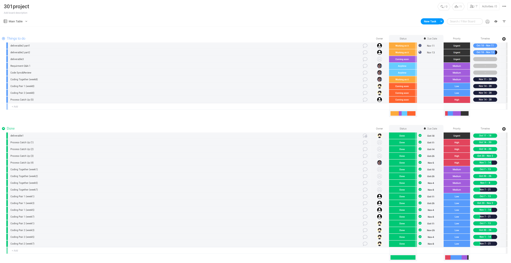
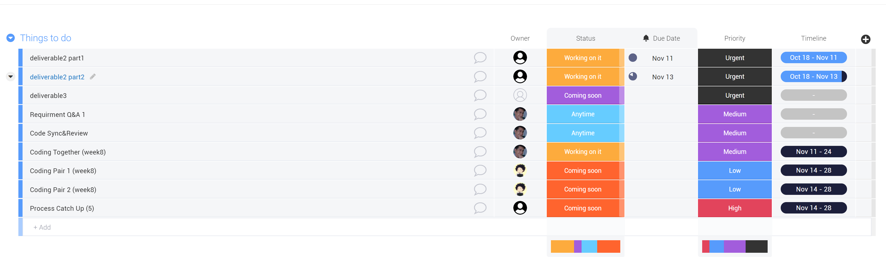
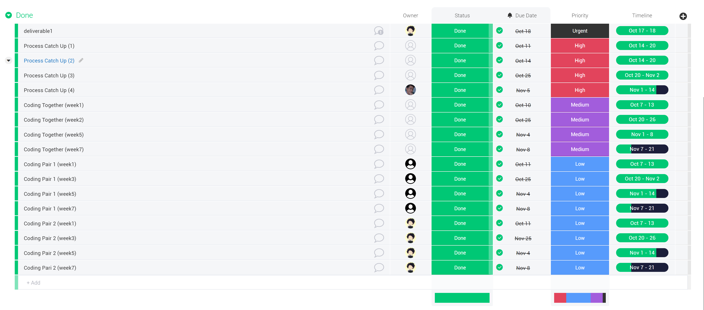
It consists of two major parts: Things to do and Done. Each entry of the table corresponds to an event, an entry displays the people that are invovled, status and priority of the event, as well as the due date and timeline.

* A schedule that visualizes all the events
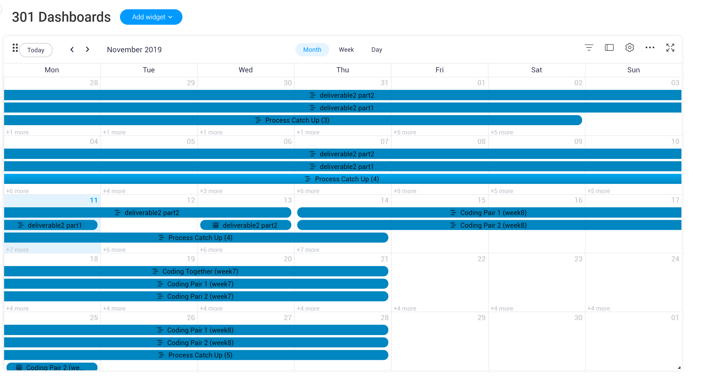

* A general to-do list for milestones and a more specific to-do list for events that need to be done in two weeks.
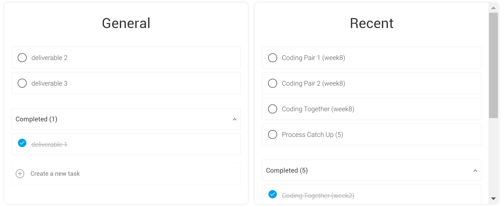

* A battery to show the overall progress and a corresponding Llama farm to cheer people up;)
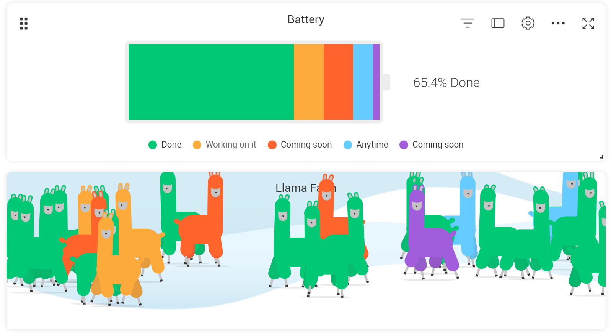

####

* Tracking

We check our to-do lists and the main table regularly.

* Task Assignments

Firstly we evalute every task, decide its priority and focus. Based on our firstly evaluation, we assign tasks to members, evaluate the results of the past tasks to adjust our assignments. In addition, people can comment on the event if they think something is not working properly. We will hold meetings to discuss the issues, then make some changes based on the comments and our discussion.
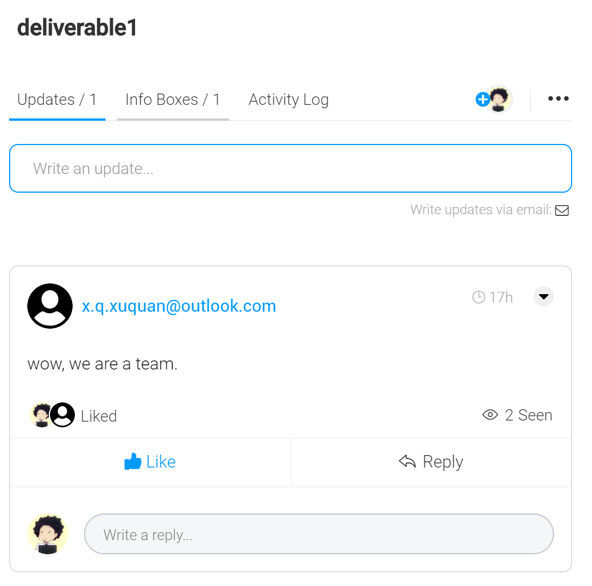

#### Deployment and Github Workflow

 * Workflow  
   1. create a local branch for the feature/page that need to work on  
   2. make changes and commits to that feature/page branch  
   3. review and test by the developer on the feature/page branch  
   4. merge the feature/page branch to master branch  
   5. resolve conflict if it occurs (since most features/pages are independent, conflicts rarely occur)  
   6. weekly code review meeting  
   
   In this workflow, each developer is responsible for his/her own independent feature/page branch.   
   There is less interaction between different developers' work and fewer conflicts as a result, the developer can also focus on a specific functionality with fewer communication costs.  
   Our weekly code review meeting also ensures the quality of our code.  

* Naming Standards
    In the state of App.js where we store all the data of user's input in our web, we follow the Naming Standards as below:  

    "_date" suffix for all the dates variables  
    "_amount" suffix for all the integer amount variables  

* Deployment
    Heroku: we simply commit and push the code to the Heroku repository, then Heroku will automatically build and deploy the web application.  

    The process of deploying our React App on Heroku is easy and efficient. The developer can focus more on the code instead of infrastructure

## Product

#### Goals and tasks

* For this iteration, we are aiming to complete the landlord view's important features which are decided by our group and partner, in particular are (from most to least important): 
    * export to PDF    
      * User Story (for export to pdf, review and download feature)
          * As a landlord, I want to generate a formal Ontario Residential Tenancy Agreement base on all the information that I provide so that I can review the Lease Form and also send a copy to the tenants.
          * Goal
              * Have the ability to generate a standard lease form base on the given information
              * Have the ability to review and download the standard lease form
              * Have the ability to send a copy of the standard lease form to tenants
          * Task
              * Client Side: End page
                  * draw the Export button and link it to the export function
                  * the export function send the data in form of Json object to the server, then it will
                  accept the pdf file sent from the server for review and download purpose
                  * draw the Review and Download button and link them to the review and download function
                  * the review function will display the received pdf file and display it
                  * the download function will store the pdf file to local hard drive
                  * draw Send to tenant button and link it to sendToTenant function
                  * sendToTenant function add the permission for tenant account to view and download the
                  standard lease form pdf
              * Server Side
                  * accept the data from client side as Json object
                  * send the Json object to ExportToPDF program
                  * generate the output pdf of the stand lease form
                  * send the pdf form back to client side for review and download

    * timeline   
      * User Story (for timeline)  
          * As a landlord, I want to have a visualized overview of all the important milestones in a listed calendar view. The important dates I need to get notice of include but not limited to agreement date, deposit due date, my tenant's move-in date, and the fixed-term rent payment due date.
        * Goal
            * Have the ability to provide a list calendar view of dates in chronological order
            * Have the ability to have different highlight color for different dates in these categories:
                * fixed term
                * month-to-month
                * pro-rated
                * important dates
            * Have the ability to calculate each month's rent payment due date based on the start date
        * Task
            * Include a brief introduction to give an overview of this page
            * Create 4 different colored label tags, to indicate four types of dates
            * Pull out important dates data from states in app.js
            * Create a table
            * For the left column of the table, create colored date bubble
            * For the right column of the table, add a brief line to indicate what date it is
            * Calculate monthly payment due date based on the start date

    * additional terms    
      * User Story (for addition terms - additional_main page)
        * As a landlord, I want to decide if I need to give some additional terms, so that for my tenent can view this additional terms to obey.
        * Goal
          * Having the ability to view what the additional terms are or if necessary to add.
          * Having the ability to select how to build my additional terms.
          * Having the ability to go to the branching logic page that the landord choose.
          * Having the ability to go back to previous page.
          * Having the ability to go to this main page by selecting from the navigation bar.
        * Task
          * Draw the view of the "a_terms" Page.
          * Let the user single select the different ways of building additional items when users click on specific way. Only one way would be selected at a time.
          * Add a next buttion to link to next page.
          * Make the next button disable iff users do not click the way of building additional items. And available when users click on specific way of building additional items.
          * Implement the next button link branching logic to other pages. "Without additional terms" goes to "end" page, "General package" goes to "general package" page, and "Build from scratch" goes to "build package" page.
          * Implement the previous button at the footer, going to previous page.

      * User Story (for addition terms - general package)
          * As a landlord, I want to add my additional terms in common which means that I add a gerenal additional items package most landlords have always diecided, so that I can save my time and let my tenent obey these terms.
          * Goal
            * Having the ability to view all the general additional term.
            * Having the ability to go back to previous page.
            * Having the ability to go to next page.
          * Task
            * Draw the view of the "general package" Page.
            * Make the terms hidden iff users do not click the category of additional items. And show the specific terms when users click on specific category of additional items.
            * Implement the previous button at the footer, going to additional_main page.
            * Implement the next button at the footer, going to end page.

      * User Story (for addition terms - build package)
          * As a landlord, I want to custom my additional terms which means that I can choose additional items and I can write my own additional items, so that I can build my own additional terms package.
          * Goal
            * Having the ability to view all the additional term.
            * Having the ability to select the addtional terms that landlord want to add into the final addtional package.
            * Having the ability to write some new addtional terms by Landlord themselves and Landlord can choose to add the new addtional terms to final package or not.
            * Having the ability to popup a message when terms add into (or delete from) the final addtional package.
          * Task
            * Draw the view of the "Building package" Page.
            * Make the terms hidden iff users do not click the category of additional items. And show the specific terms when users click on specific category of additional items.
            * Add the specific term into final backage when users click on the plus sign("+") in front of the specific term and delet the specific term from final package when users click on the minus sign("-") in front of the specific term.
            * Add a custom button that allow landlords to write their own addtional terms.
            * Add a popup window the Landlord want to write new additional terms.
            * Tracing the input that Landlord is typing in the popup window, so that Landlord can know the length of the input and how many characters that Landlord can types.
            * Add a popup message when terms add into (or delete from) the final addtional package.

    * navigation component    
      * User Story (for navigation component)
        * As a user, I want to choose which part of the form I want to fill in freely , so that I complete the form as my working preference.
        * Goal
          * Having the ability to navigate what all the main parts the lease form have.
          * Having the ability to naviate what the sub parts are for each main part.
          * Having the ability to go to the specific page that the user choose from the sub navigation item.
          * Having the ability to view the navigation bar after aggreeing the term of use.
        * Task
          * Draw the view of the "navigation" Component and "sub_navigation" Components.
          * Add the main navigation item list for the component.
          * Make the sub navigation list hidden iff users do not click specific main navigation item. And show when users click on that specific navigation item. Each main item only show its own sub navigation list.
          * Implement branching logic for user clicking the specifi sub naviagtion list item to the specific pages.
          * Implement the navigation component in most pages other than login, welcome, concerns and disclaimer.

    * money     
      * User Story (for money - rent part)  
          * As a landlord, I want to customize the contents of the rent. So I can specify details of the rent and finish the agreement.
          * Goal
              * Have the ability to make the rent fix-termed or not and select the corresponding start date and end date
              * Have the ability to set the base rent and choose the frequency to pay the rent from month/week/other
          * Task
              * Rent page
                  * Draw the view of the "rent" Page.
                  * Have input fields to add the amount and dates
                  * Enable/disable input based on the state of input fields

      * User Story (for money - deposits and move in dates parts)  
          * As a landlord, I want to ask for the deposits and the information about move in dates of my tenants, so I can manager my time and account easier.
          * Goal
              * Have the ability to let the landlords ask for key deposits and the last month's deposits
              * Have the ability to know the move in date of the tenant and the start date of the fixed term
              * Have the ability to the option to add pro-rated rent
          * Task
              * Deposits page
                  * have two forms to let the landlord choose that is the deposit required or not
                  * if required, we will add input fields to let the landlord add the amount and due date
              * Move in date page
                  * have input fields to add the amount and dates
                  * have nav bar to make an option about pro-rated rent

    

  

#### Artifacts

  * Builds the structure of entire project, and assigns work to each sub team, and generates questions for next meeting with partners, so we can do our work step by step:
    * Those are useful artifacts since these are the proof of how we divid the project in a high-level understanding way. 
    
    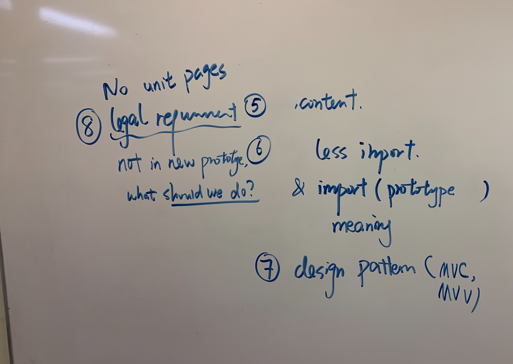
  * Choosing the design pattern for the porj and draw the sketch of the patterns, so we can write our code bases on the structure below and we can have a clear code structure.
    * Those are useful artifacts beacuse these are the sketchs of our data structure and these artifacts show the basic relationships between each js files.
    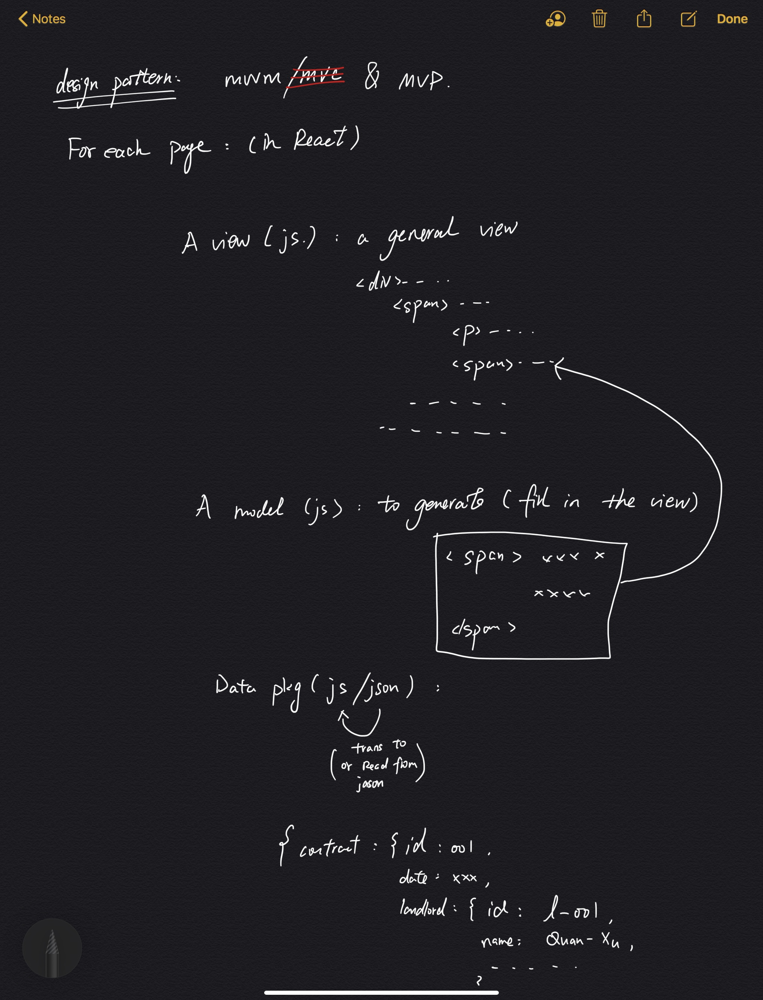
    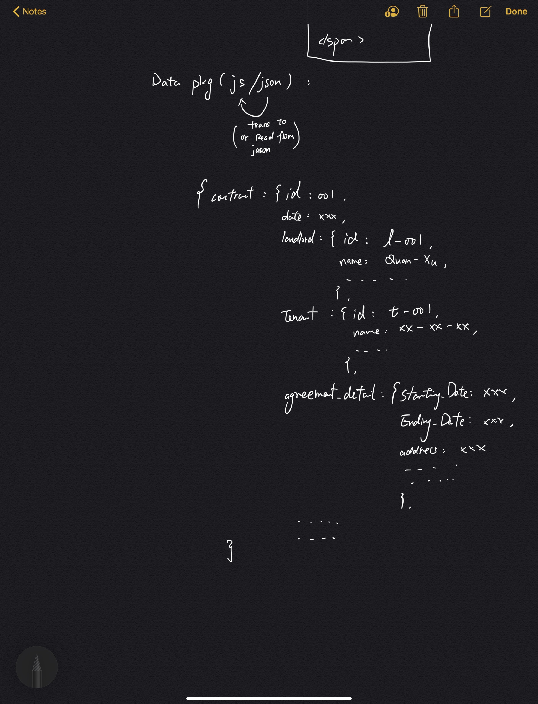
  * Having discussion with partners and exchange ideas about the project, so we can make and design our project better:
    * This is useful since this shows how we communicate with our partner and how we design or enhance the project ideas.
    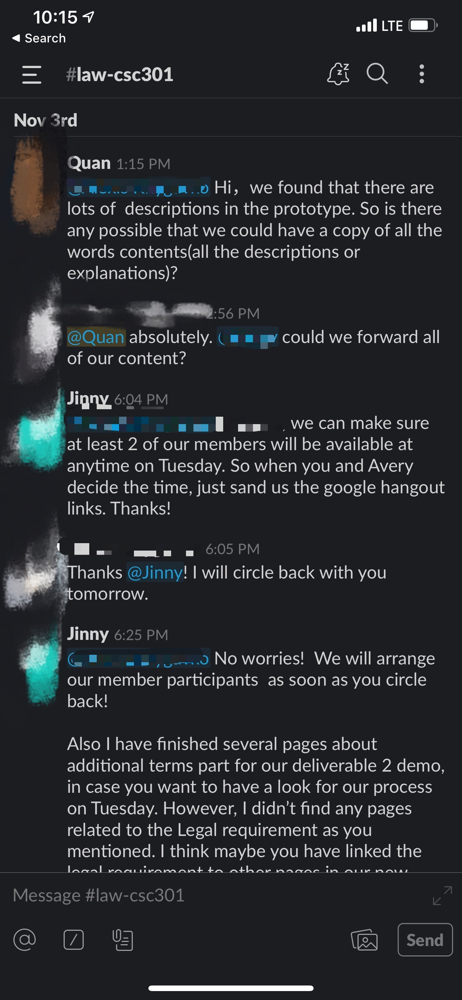
  * Planning ahead and schedule works for each week, so we can work ahead and we may not need to do some rush work.
    * These artifacts are important since those show how we organize our work.
    
    
    
  * Having the prototype of our project is userful, so we can draw the web based on the prototype and the formatting of web app will be identical and not disorganized. (some part of the prototype are shown below):
  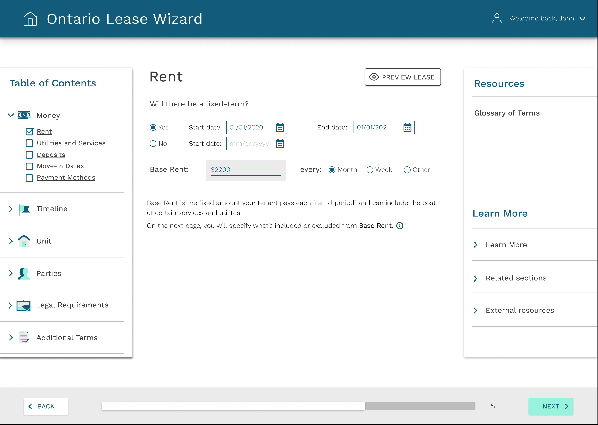
  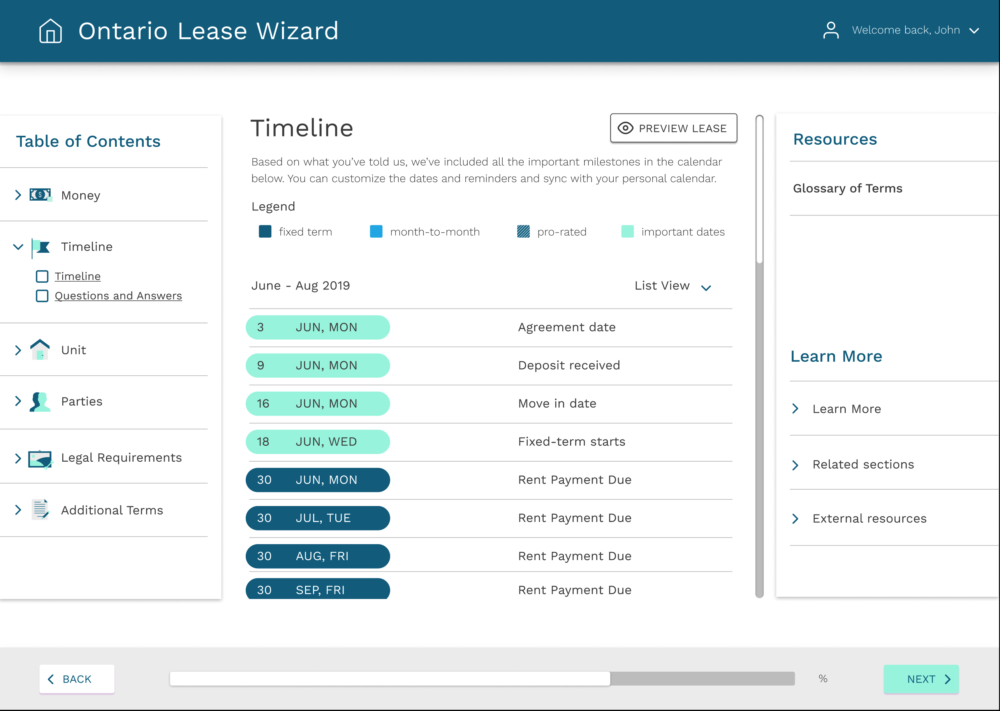
  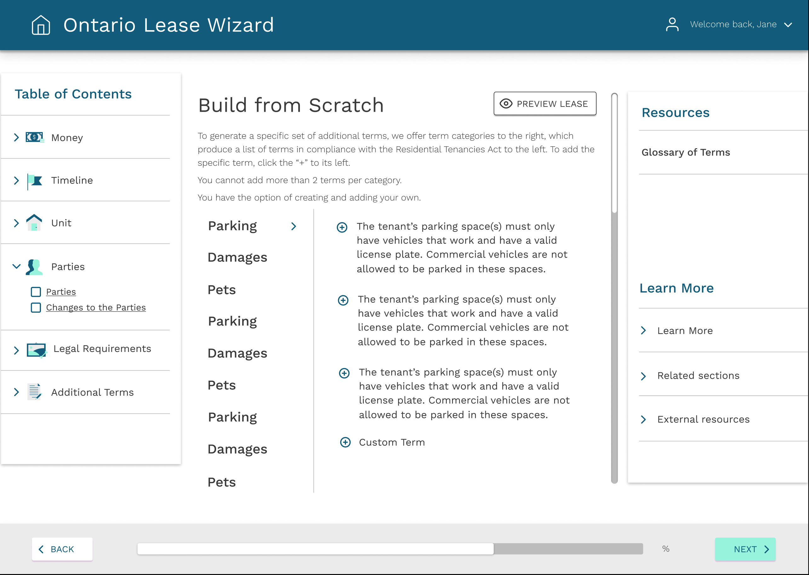
