# Lease Wizard

## Iteration 02 - Review & Retrospect

 * When: Nov.11th and Nov.15th
 * Where: Bahen centre lab room 
 
## Process - Reflection

#### Decisions that turned out well

* Having Weekly Meetings
    * The most important process-related decision was that we planned to have meetings weekly. One weekly meeting is with our partner, and another weekly meeting is our group internal meeting on every Monday after 301 tutorial. Our meeting with partner does not have a fixed day but depends on their and our available time, and the frequency is once every week. This meeting allows us to report our progress to partner, to ask them some questions we met during working, and they can give feedback on what we have done in the previous week. Our internal group meeting is that every sub-group report their progress, discuss some problems we met together, then assign tasks to 3 sub-groups for next sprint. Regular meetings allows us to have a better understanding of other groups' progress, to communicate and feedback in a timely manner, and to arrange next sprint's tasks in a targeted manner.

 * Using Task Management Tool
     * There is also another process-related decision that turned out well, which was to use 'Monday' as our tool to manage our tasks. Since we meet regularly every week, and different tasks are assigned to everyone, it is likely that people can forget some of their tasks. Therefore, we decided to use some tool for task management. In this way, everyone could clearly see the important milestones, as well as their finished and unfinished tasks.
     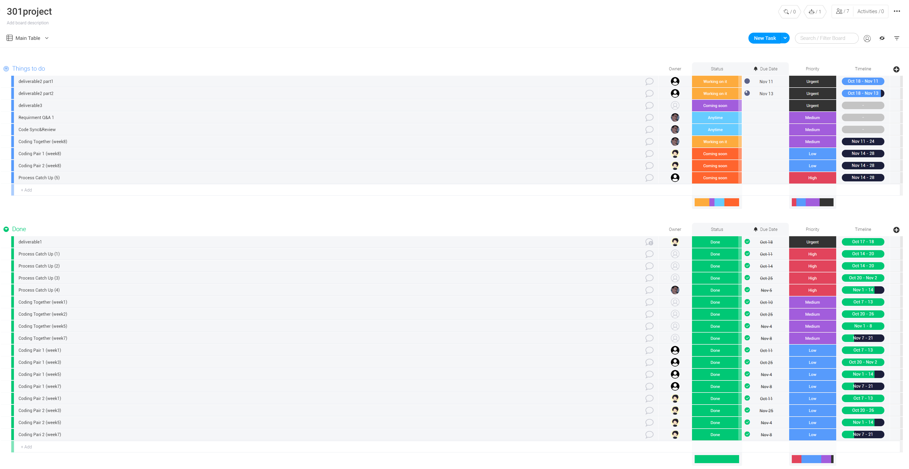

 * Using Communication Tool
     * Another process-related decision that turned out well was to use 'Slack' as our communication tool with our partner. We created a channel which have our group and our partner as the members. Sometimes email could cause a delay, and here comes the benefit of using instant messaging applications. We have used Slack to decide the time of meeting with partner, to discuss some questions, and to give feedbacks, etc. For example here, we asked for their approval of some decisions we wanted to make, and also arranged meeting time.
     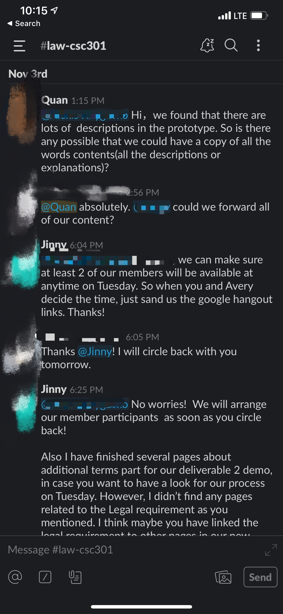

#### Decisions that did not turn out as well as we hoped

* Lack of Git Using Rule Initially
     * One decision that did not turn out as well as we hoped was that we have not had meetings about the git using rules of our group before working on the project, thus leads to two main consequences. The first was that we lack communication of what could and could not be pushed, one example of the consequences was lots of us pushed node_modules, and had to revert git version or delete the file afterwards, which wasted time and caused troubles for that member himself and other members who pulled. Another was that we did not take advantage of using pull requests, which results in a lack of reviews for the changes. It leads to potential risks in our code.

 * Lack of Structure Discussion In The Beginning
     * There was another decision that did not turn out well as we expected. In the beginning, everyone of our group was too desired to implement the features and somehow ignored code styling, which caused a lot of code smells. Although we had a meeting afterwards to have a discussion on this problem, and as a result we decided to use MVVM as our design pattern, it still wasted us some time to re-format some previously written code, and this step could be avoided by deciding code structure at the beginning of the meeting before everyone starts to code.

#### Planned changes

 * Change the location of the popup message (In addtion terms of building package section)
    * Why I need to change: 
      * I wanted to popup message at the top of all content, since the popup message will not block any content of the page when it shows up on the page. However, I cannot show the popup message at the top since there is a border at up and we don't want to chang the border. 
    * How I changed the plan:
      * I find a area to show the popup message where is beside the title of current page. If I show popup message in this area I will not block anything. Actually, I was thinking to show the popup message at the bottom, however I faild since the bottom of the current page is not the actul bottom of the page. So I changed the popup message to such area.

 * Extract the common patterns and styles in view.js and create corresponding classes in CSS.
    * Why I need to change:
      * It makes the structure clearer and easier to modify
      * It reduces redundancy and unnecessary dependencies
      * It makes future implementations of similar patterns much easier
    * How I changed the plan:
      * Creating corresponding styling class/id in CSS

## Product - Review

#### Goals and/or tasks that were met/completed:
* Navigation bar and corresponding sub navigation list
  * Able to let user navigate and jump to each sub part of the lease form
  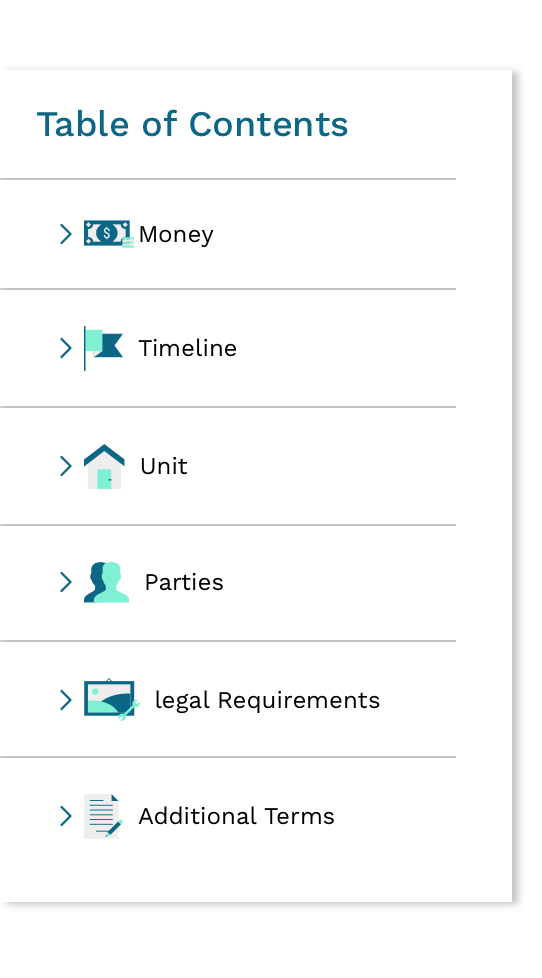
  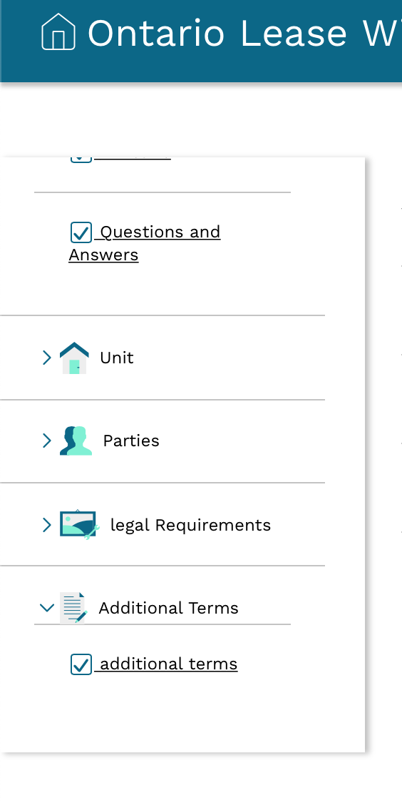

* Rent in "Money"
    * Able to let Landlord ask for the information of fixed term rent.
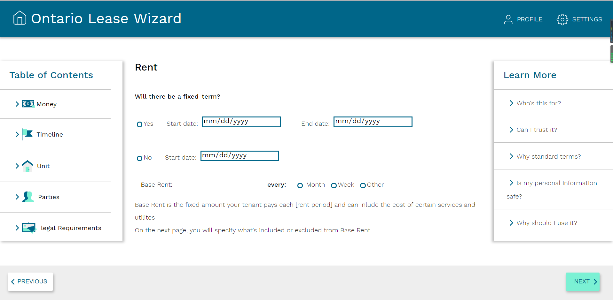

* Deposits in "Money"
    * Able to let Landlord ask for last month's deposit and key deposit.
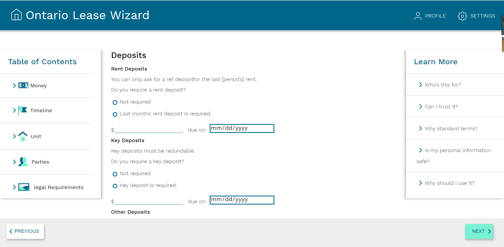

* Move-in Date in "Money"
    * Able to let Landlord ask for move in date and other important dates.
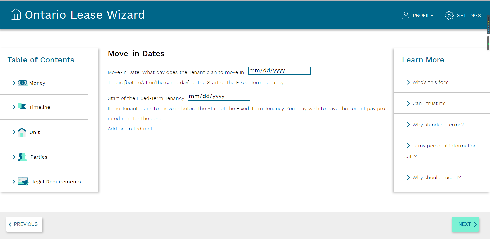
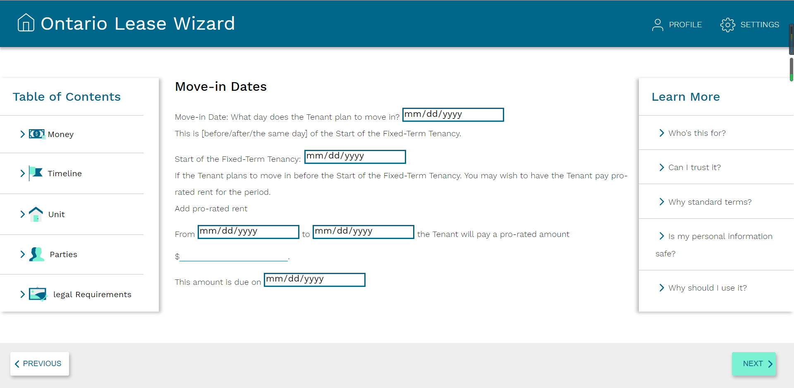

* Able to show pages in "Timeline" section
  * Able to show timeline page.
  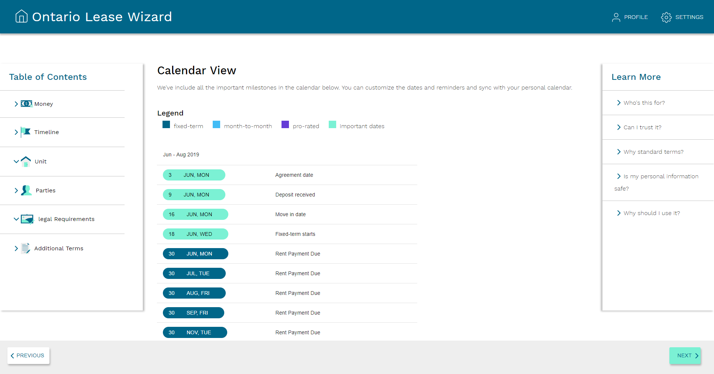
  * Able to show Qestions and Answers page.
  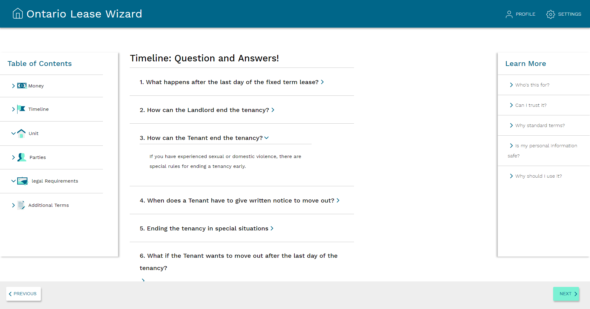

* Able to access the additional terms main page
  * Able to let the landlord select the ways of building additional terms in this page and update to the additional terms to final package.
  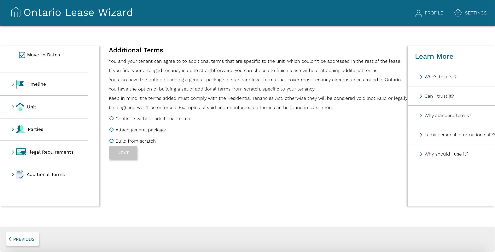
  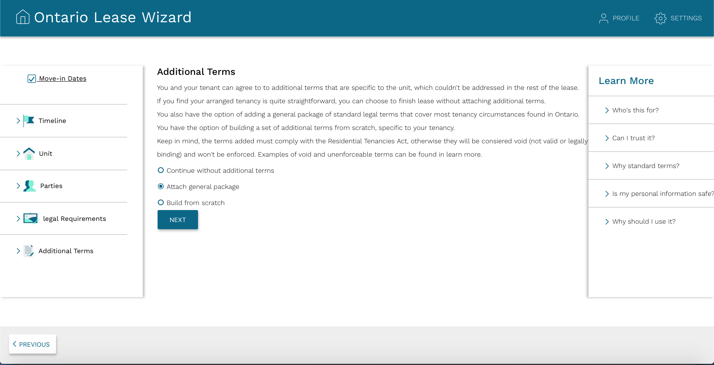

* Able to show general package in "Additional terms section"
  * Able to let Landlord navigate the specific terms in general package.
  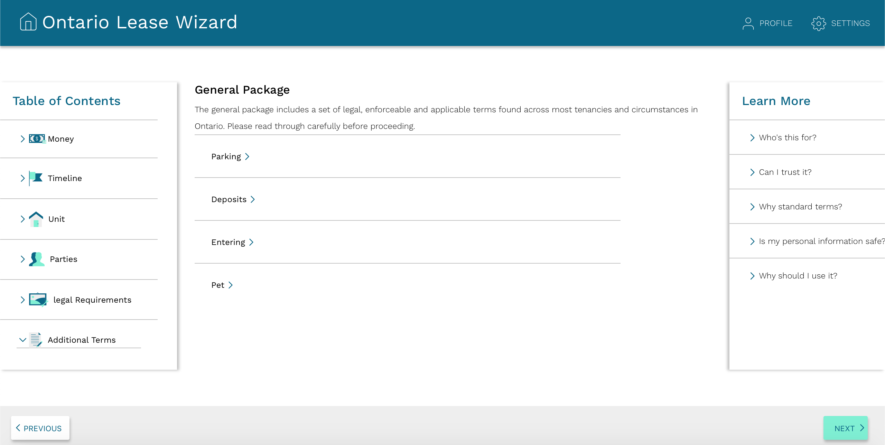
  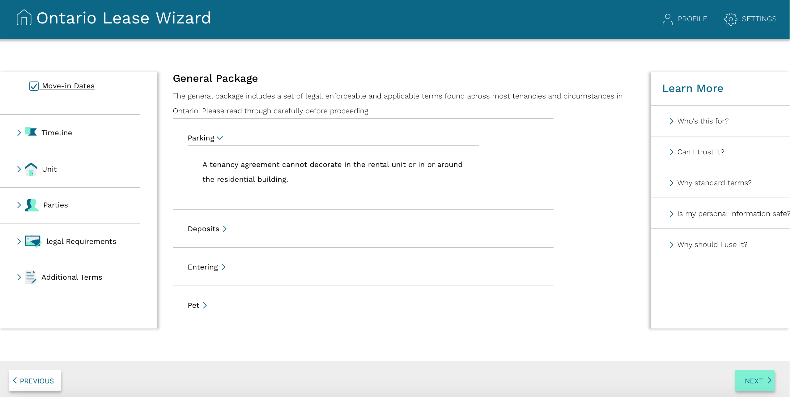

* Able to build package in "Additional terms section"
    * Able to let Landlord select addtional terms and make new addtional terms, and update to the additional terms to final package.
    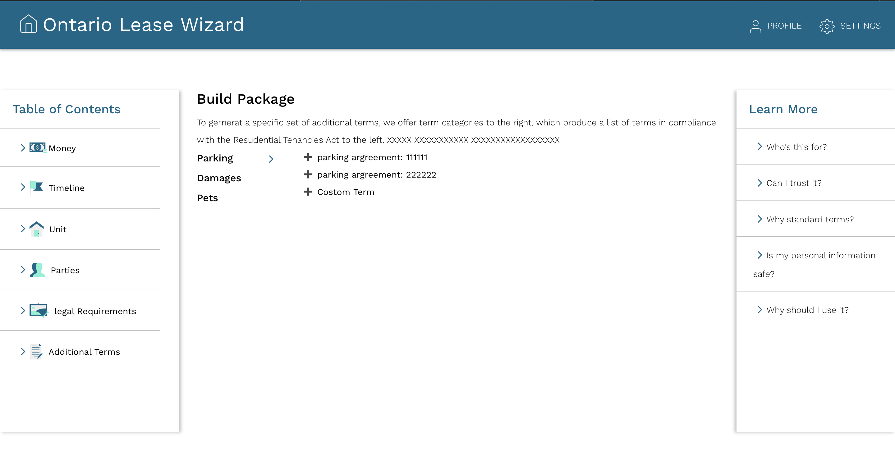
    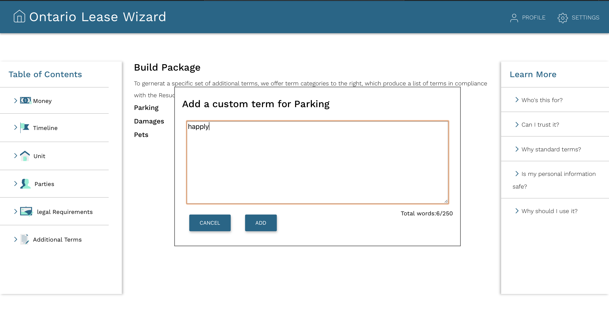
    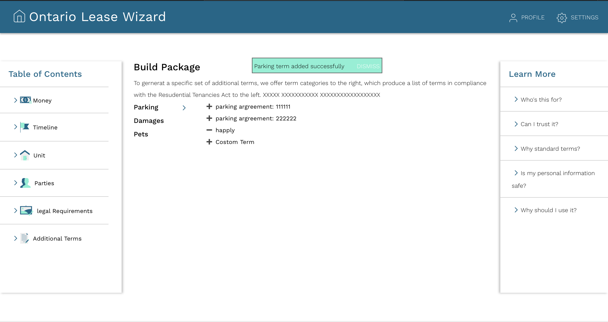

* Export to PDF(independent Java program)
  * A Standard Form of Lease pdf document could be generated by our ExportToPDF program.
  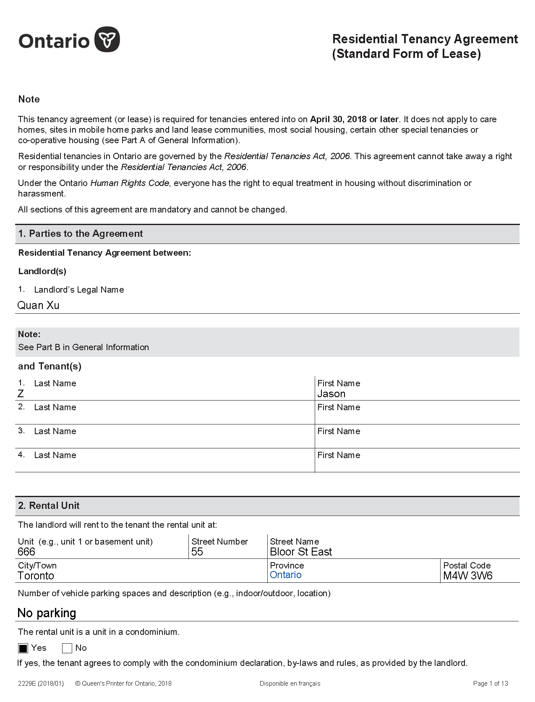

#### Goals and/or tasks that were planned but not met/completed:

 * Utilities and Services, Payment Methods, those 2 pages are not completed.
    * it was not met/completed because:
      * We haven't got to it yet, since timeline and export to PDF will need to use the dates from Rent, Deposits and Move-in Date, our team decided to complete the timeline and export to PDF first(those two are the important features). Therefore, we don't spend time on those 2 pages.
    * right now:
      * Finish it in next iteration

 
 * Server Side Export to PDF
   * it was not met/completed because:
      * Although the export to pdf can be achieve by the current product, the program have to be run mannully and the document generated is currently based on the demo data(fake data). 
   * right now:
      * In order to complete implement this functionality, a server is required since it is more reasonable to store and process the data in server side instead of client side as well as using those data to generate a pdf document. In addition to this, the client side will have to gather more information from user and form a Json object and make a server call to provide the data needed. After the server call is made, the server will be able to generate the required document and send it back to client side for view and download.

 * Timeline Section: generate pages based on user's input from pages in the Money section
   * it was not met/completed because:
      * The user's input in the Money section was not stored correctly. Therefore, we can not get real data and we are using mock data for now.
   * right now:
      * Implement it based on a planned data format and test by mock data. Once the team responsible for the Money part can store the data as it was planned, everything should work correctly.

#### How was your product demo?
  * Before the demo, we decided to have 3 members as 3 representatives for each group to attend the demo since we are divided into 3 sub-groups. Then as preparation, for tasks we planned to finish for this deliverable, we listed their progress, whether its completed/uncompleted/changed, if for uncompleted or changed we provided a reasonable reason. After that, We went through together every feature we completed, demonstrate its view and functionality to each other as a practice. Finally We deployed our project, and tried to open the url on an unused computer at school lab room to see if it could work. It turned out it worked, then we sent the link to our partner prior to the demo.

  * During the demo, we first talked about level of completion of the project for this deliverable, gave them a brief understanding of which part we have finished. Then for tasks we completely finished, we demonstrated that feature's view and its functionality, then we explained how to use this functionality in detail, and asked for their feedback. For some tasks that are partially finished or some changes were maded after last meeting, we explained the reason and asked for their suggestion, then we discussed the solution together, and put this onto our plan for next deliverable.

  * We have explained and shown our current product to our partners and they were satisfied with most of the features; however, some changes are required and will be specified in next question. We also explained some technical difficulties we were facing while implementing those feature as well as our solution and our plan for the future. Specifically, we explained why the export to PDF feature was done by an independent Java program. 

  * Also, there are some changes that we will make in future. 
    1. We will add a progress bar at the bottom of each webpage so that our user can keep track of the whole precess. 
    2. We will check every user input and pop up a warnning message if the user made an invalid input. For example, for deposit part, the user are suppose to enter numbers instead of letters. 
  * If there are more change need to be made, out partner will report the issues with GitHub. We will look into those issues if there is any and make improvement 

  * After this demo, we have learned several things:
    * Always plan ahead. In order to well-explain the product we build, we have to be extremely familiar with every feature and its high-level implementation idea.
    * A note-taker is necessary for writing down the comments of our partner for future improvement. 
    * When we are building a product, we cannot assume that every user knows how to use the product; instead, we should assume our users have no idea about how to use the product. Therefore, guide message and error checking is necessary to improve user experience.
    * We should build a product from users' perspective. Always assume we are users to our product and ask ourselves what we want and if we are satisfied with the current product.
    * We should focus on details and keep track of the tasks we have already complete and the tasks we have not complete yet, so that we will not miss any feature that we are supposed to implement. 

## Meeting Highlights

Tasks for next iteration:

* Team A ("Yiyang Hua \[Irene], Tianhang Wang \[David]"):
    * login/Sign up  
        * This is one of the important feature in the project that our partner told us.
        * Our project will use unique email address to sign up for a tenant or a landlord, and everyone has at most 2 accounts since s/he can be a tenant and a landlord at the same time. Since there are at least one tenant and one landlord to sign the lease form, we will have a database for the unique id of each lease form, and save it under the corresponding accounts as well, which means we only give the corresponding tenants and landlords the access of their lease form.
    * For "Legel Requirment" page: 
        * Draw the page
            * Make a list form for all legel requirments
            * Make check boxex for seval legel requirment blocks
            * Hide the contentg of legel requirments unless user click them.
            * Update date to App.js
            
* Team B ("Shang Liu \[Shaun], Qi Zou"): 
    * For "Timeline" section:  
        * For "Timeline" page:    
            * Use real data from user's input instead of mock data to generate the list
        * For "Questions and Answers" page:   
            * Use real data from user's input instead of mock data to generate the data
    * For "Parties" section:   
        * For "Parties" page:  
            * Make all the fields to enter information of landlord and tenant
            * Store all the data in App.js
        * For "Changes to the parties" page: 
            * Make a list of problem
            * When click the problem, expand the corresponding answers and check box
    * Modal 
        * pop up when user tries to skip to random parts of navigation

* Team C ("Zijin Zhang \[Jason], Jingqi Zhang \[Jinny] and Quan Xu \[Quan]"):
    * For "end" page: 
        * Active the button "send to tenant" 
            * Popup a window to let Landlord type the tenant email address(maybe add a function to check the validity of the email address)
            * Popup a message when send email succesfully
        * Active the button "print your lease"
            * save the lease agreement pdf version to local
    * For "Money" page: 
        * "Utilities and Services" section 
            * Draw the page
            * Make a list form(maybe a Table form)
            * Make popup windows to edit notes and add notes
        * "Payment Methods" section  
            * Draw the page
            * Make check boxes
            * Make a list form

